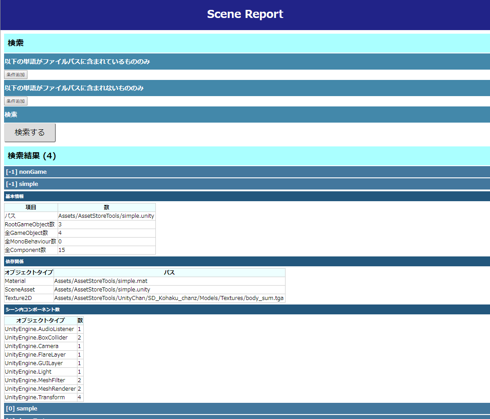
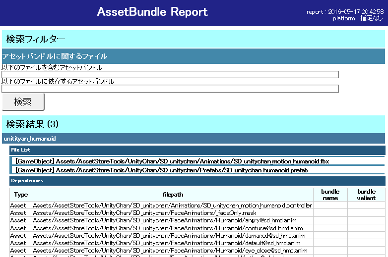

# AssetsReporter
Read this in other languages: [English](README.md), 日本語 

# 注意
現在 Internet Explorerer系のブラウザでの閲覧が出来なくなってしまっております
Chromeブラウザをお使いいただければと思います

[Unity] Import設定などをブラウザ上で閲覧/検索できるようにするツールです 
 
目的：不適切なImport設定になっているテクスチャ/サウンド/モデルデータ等を見つけるためのツールです。 
このツールはUnityプロジェクト内(Assets以下)に含むEditor拡張と、プロジェクト内に含めないHTML部分の二個で成り立っています 
本プロジェクトを丸ごとコピーして利用して下さい。

# デモ
[`https://wotakuro.github.io/AssetsReporter/`](https://wotakuro.github.io/AssetsReporter/) 
AssetsReportの結果がこのような感じで閲覧可能です。 
※デモは英語版ですが、本ブランチから落とせば日本語表記です！！

# 使い方

<pre>
メニューの「Tools/AssetsReporter」を押すことで上記Windowが開きます。

Texture/Model/Audio等の項目別に呼び出して使います。
「Report」ボタンを押すとプロジェクト内を解析し、ブラウザで表示することが出来ます。

それぞれについては以下にて。

</pre>

# TextureReporter

<pre>
プロジェクト内のTextureの設定をレポートします。
圧縮フォーマットは適切かなどの確認等に使えればと思います。
</pre>

# ModelReporter

<pre>
プロジェクト内のModelの設定をレポートします。
Rigの設定はどうなっているか、Mesh最適化等はちゃんとしているか等々確認できます
</pre>

# AudioReporter

<pre>
プロジェクト内のAudioの設定をレポートします。
圧縮フォーマット等の確認にお使いください
</pre>

# AssetBundleReporter

<pre>
作成予定のAssetBundleを閲覧可能な形にします
</pre>

# SceneReporter

<pre>
シーンの上皮王を閲覧できます
</pre>

# ResourcesReporter

<pre>
プロジェクト中にある「Resources」ディレクトリを一覧にします。
Resourcesフォルダはあるだけでメモリを消費するので可能な限り消しましょう。
</pre>

#ignoreについて
<pre>
以下の二つを追加すると良いでしょう…
「/AssetsReporter/AssetsReporter/result/*.js」
「/AssetsReporter/AssetsReporter/result/preview/」
</pre>

# その他
こちらではjQueryを利用しています
https://jquery.com/
