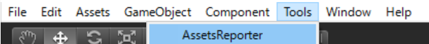
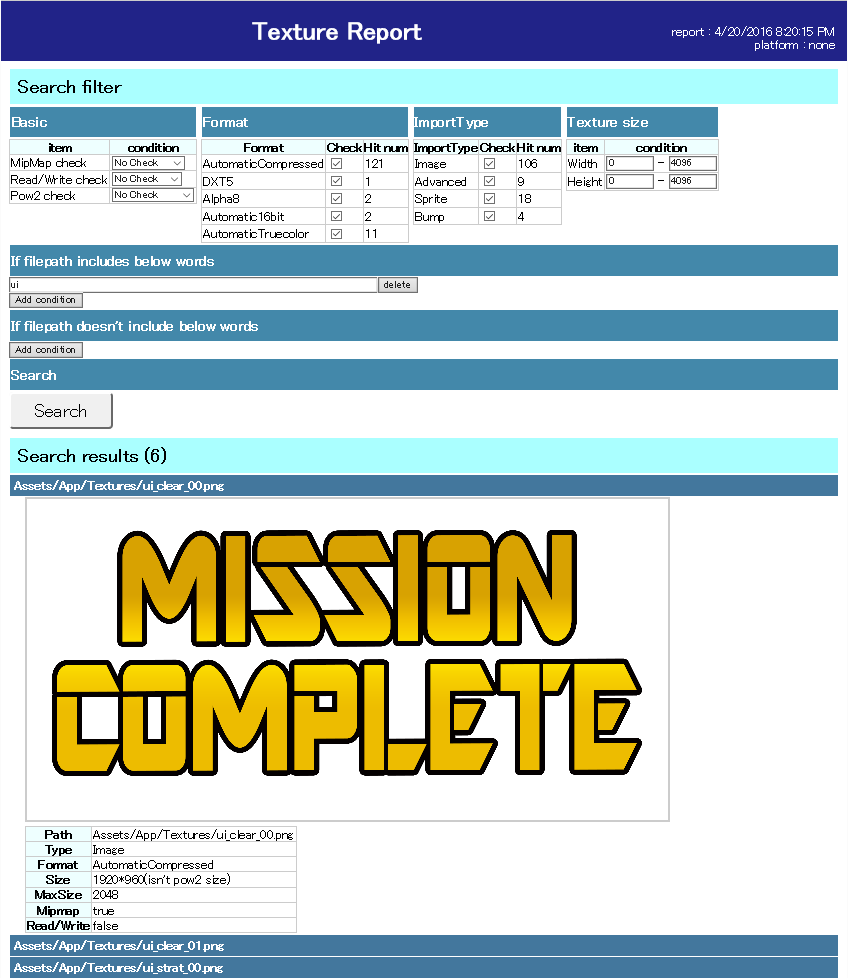

# AssetsReporter
[Unity] You can detect storange import settings on web browser. 
 
Purpose of this： This software was developed for detect storange "Import settings"(for texture/audio/model). 
Copy this to your project.
(Not only Assets directory, but also AssetsReport directory.)

<pre>For Japanese (日本の方向け)
branchをjapaneseにする事で日本語版になります。
</pre>

# How to use

<pre>
Click "Tools/AssetsReporter" to open window.
</pre>

<pre>
This reports independentae of each part( "Texture/Model/Audio").
Push "Report" button to analyze project, then open web browser.
</pre>

# TextureReporter

<pre>
This reports Import settings of Textures.
You can use this like these cases.
 - Is compression format suitable?
 - Are there any textures which size isn't power of two.
</pre>

# ModelReporter

<pre>
This reports Import settings of Models.
You can use this like these cases.
 - Is optimize mesh ?
 - Is Rig suitable?
 - Are there any models which is checked "Read/Write".
</pre>

# AudioReporter

<pre>
This reports Import settings of AudioClips.
You can use this like these cases.
 - Is compress format suitable?
</pre>

# AssetBundleReporter
<pre>
currently developing...
You'll be able to watch assetbundle data on web browser.
</pre>

#about ignore
<pre>
report results are in below.
 "/AssetsReporter/AssetsReporter/result/*.js"
 "/AssetsReporter/AssetsReporter/result/preview/"
you'd better to add ignore list.
</pre>

## TODO
refactoring 
texture thumnail not only png 
summary report 

# Other
This software is depends on jquery.
https://jquery.com/
